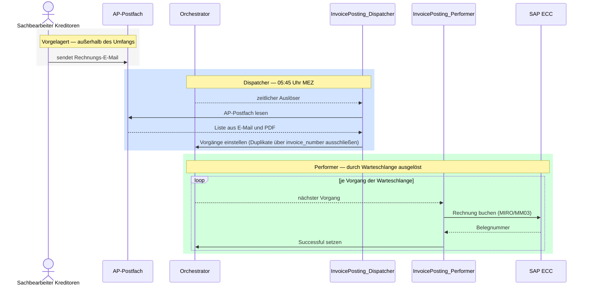

```mermaid
sequenceDiagram
    actor Human as Sachbearbeiter Kreditoren
    participant Source as AP-Postfach
    participant Orc as Orchestrator
    participant Disp as InvoicePosting_Dispatcher
    participant Perf as InvoicePosting_Performer
    participant SAP as SAP ECC

    rect rgb(245, 245, 245)
        Note over Human,Source: Vorgelagert — außerhalb des Umfangs
        Human->>Source: sendet Rechnungs-E-Mail
    end
    rect rgb(210, 228, 255)
        Note over Orc,Disp: Dispatcher — 05:45 Uhr MEZ
        Orc-->>Disp: zeitlicher Auslöser
        Disp->>Source: AP-Postfach lesen
        Source-->>Disp: Liste aus E-Mail und PDF
        Disp->>Orc: Vorgänge einstellen (Duplikate über invoice_number ausschließen)
    end
    rect rgb(210, 255, 220)
        Note over Orc,SAP: Performer — durch Warteschlange ausgelöst
        loop je Vorgang der Warteschlange
            Orc-->>Perf: nächster Vorgang
            Perf->>SAP: Rechnung buchen (MIRO/MM03)
            SAP-->>Perf: Belegnummer
            Perf->>Orc: Successful setzen
        end
    end
```
