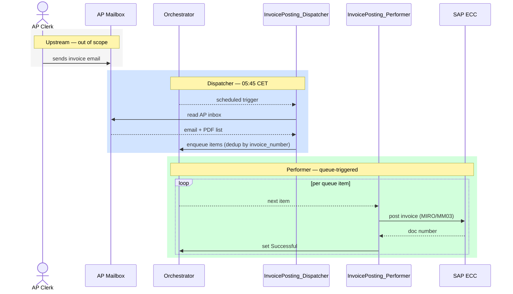

```mermaid
sequenceDiagram
    actor Human as AP Clerk
    participant Source as AP Mailbox
    participant Orc as Orchestrator
    participant Disp as InvoicePosting_Dispatcher
    participant Perf as InvoicePosting_Performer
    participant SAP as SAP ECC

    rect rgb(245, 245, 245)
        Note over Human,Source: Upstream — out of scope
        Human->>Source: sends invoice email
    end
    rect rgb(210, 228, 255)
        Note over Orc,Disp: Dispatcher — 05:45 CET
        Orc-->>Disp: scheduled trigger
        Disp->>Source: read AP inbox
        Source-->>Disp: email + PDF list
        Disp->>Orc: enqueue items (dedup by invoice_number)
    end
    rect rgb(210, 255, 220)
        Note over Orc,SAP: Performer — queue-triggered
        loop per queue item
            Orc-->>Perf: next item
            Perf->>SAP: post invoice (MIRO/MM03)
            SAP-->>Perf: doc number
            Perf->>Orc: set Successful
        end
    end
```
