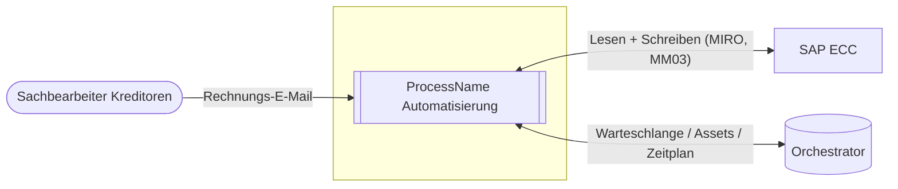

<!-- Nur ein Beispiel (ein erfundenes Projekt zur Rechnungsbuchung). Wird nie gerendert. So sieht ein gefülltes Systemkontext-Diagramm aus. -->

```mermaid
graph LR
    Human([Sachbearbeiter Kreditoren])
    subgraph RPA [" "]
        direction TB
        Auto[[ProcessName Automatisierung]]
    end
    Human -->|Rechnungs-E-Mail| Auto
    Auto <-->|"Lesen + Schreiben (MIRO, MM03)"| SAP[SAP ECC]
    Auto <-->|"Warteschlange / Assets / Zeitplan"| Orc[(Orchestrator)]
```
