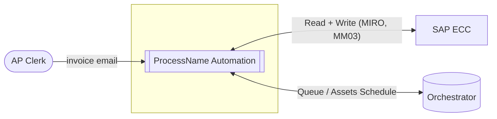

<!-- Example only (an invented invoice-posting project). Never rendered. A filled system context diagram looks like this. -->

```mermaid
graph LR
    Human([AP Clerk])
    subgraph RPA [" "]
        direction TB
        Auto[[ProcessName Automation]]
    end
    Human -->|invoice email| Auto
    Auto <-->|"Read + Write (MIRO, MM03)"| SAP[SAP ECC]
    Auto <-->|"Queue / Assets Schedule"| Orc[(Orchestrator)]
```
